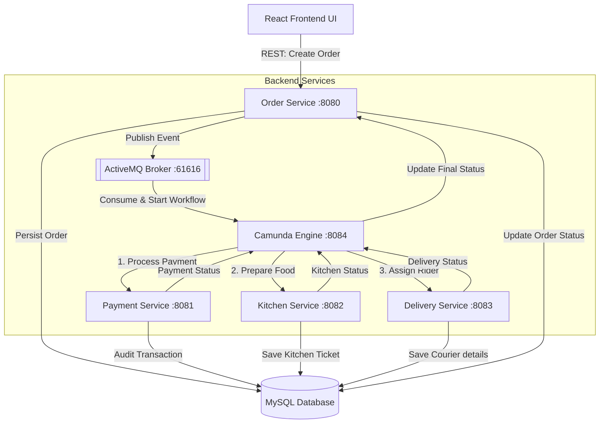

# WAFFOR's Chef - Online Food Order Processing System

Welcome to **WAFFOR's Chef**, a high-volume, asynchronously decoupled Online Food Ordering System. The system orchestrates order lifecycles using a Camunda BPMN engine and ActiveMQ message queues to pass messages between Spring Boot microservices, backed by MySQL databases and a Swiggy-style React UI catalog.

---

## 1. Architecture Diagram


---

## 2. Port Allocation Map
* **React UI (Frontend):** `http://localhost:5173`
* **Order Service:** `http://localhost:8080` (DB: `foodorderdb`)
* **Payment Service:** `http://localhost:8081` (DB: `payment_db`)
* **Kitchen Service:** `http://localhost:8082` (DB: `kitchen_db`)
* **Delivery Service:** `http://localhost:8083` (DB: `delivery_db`)
* **Camunda Service:** `http://localhost:8084` (DB: `camunda_db`)
* **ActiveMQ Console:** `http://localhost:8161` (Credentials: `admin`/`admin`)

---

## 3. How to Set Up and Run the Application

### Step 1: Start ActiveMQ Broker
Ensure your local Apache ActiveMQ broker is running on your system, listening on the default JMS port:
* Port: `61616` (JMS)
* Port: `8161` (Web Console)

### Step 2: Verify MySQL Database
Ensure local MySQL is running with database schemas created. Connection credentials are:
* Username: `prabhu`
* Password: `prabhu25`
* Databases: `foodorderdb`, `payment_db`, `kitchen_db`, `delivery_db`, `camunda_db`

### Step 3: Run the Backend Microservices
Open 5 separate terminal tabs and navigate to their respective microservice directories, then run:
```powershell
# In order-service directory:
.\mvnw.cmd spring-boot:run

# In payment-service directory:
.\mvnw.cmd spring-boot:run

# In _kitchen-service directory:
.\mvnw.cmd spring-boot:run

# In delivery-service directory:
.\mvnw.cmd spring-boot:run

# In camunda-service directory:
.\mvnw.cmd spring-boot:run
```

### Step 4: Run the React UI Frontend
Open another terminal, navigate to the `order-ui` directory, and run:
```powershell
npm run dev
```
Open your browser and navigate to `http://localhost:5173`.

---

## 5. Production Build & Deployment Steps (Docker Orchestration)
To compile and build the microservices cluster into production Docker container images:
1. **Compile microservices JARs:** Run `./mvnw clean package -DskipTests` inside each Java service directory.
2. **Orchestrate container stack:** Start the MySQL, ActiveMQ, Spring Boot microservices, and Nginx (serving React) stack with a single command:
   ```powershell
   docker-compose up --build -d
   ```
3. **Access Application:** Open `http://localhost` in your browser.

*For detailed docker configuration details and Dockerfile templates, please check the [Production Deployment Guide](file:///c:/Users/prabh/Desktop/WAFFOR-Food-Order-Processing-System/mail/deployment_steps.md) inside the `mail/` folder.*

## 4. Advanced Project Features (Bonus Showcase)
* **Swiggy-Style Food Catalog & Interactive Layout Shifting:** The 12 categories initially load in a full grid. Clicking a category shifts them into a left sidebar, opening the main container to display sub-category dish cards with "+" / "-" quantity counter controls and a sticky floating bottom cart.
* **Dialogue Box Invoice PDF Generation:** Generates and prompts to download a structured, styled PDF invoice client-side upon checkout success.
* **Pending COD Payment & Approval Stepper:** Allows users to place a Cash on Delivery order and select "No" to leave payment pending. The track order screen dynamically displays a **"Cash Payment Required"** action card. Clicking **"Confirm & Approve Payment"** clears the pending status in the database, publishes to ActiveMQ, and executes the rest of the Camunda workflow!
* **Auto-Tracking URL Parameters:** Navigating with `/track-order?orderId={id}` automatically checks and executes the visual tracking stepper.
